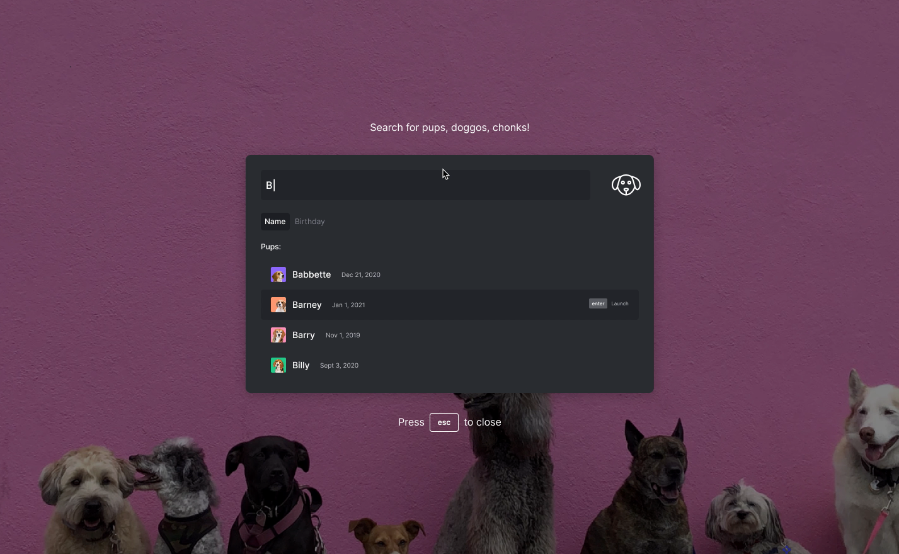

# OpenFin Frontend Challenge 

Build a mini React app implementing [this design](./design.mov)

### Acceptance Criteria

- Uses the provided [sample data](./data.json) and assets
- Incorporates keyboard commands to display and dismiss the prompt
- Focuses input automatically when the prompt is displayed
- Displays list of results filtered by `name` as text is entered into the prompt
- Sort results by `name` or `birthday` with toggle
- Text entered into the prompt clears each time the prompt is dismissed
- Incorporates motion animations where appropriate, e.g. on display, dismissal, searching, and sorting.
- Handles scaling and zooming gracefully using responsive principles, e.g. resizing the browser window or parent container and adjusting page zoom

### Delivery

- Deliver a respository and a live instance ([Netlify](https://netlify.com) works great) when you're finished
- Application builds and starts with a single command, e.g. `npm start`

### Guidelines

- Take the build as far as you like and spend no more than 5 hours on the challenge
- Use any frameworks or libraries supporting your build and be ready to discuss your decisions
- Fork this repo to get started!
